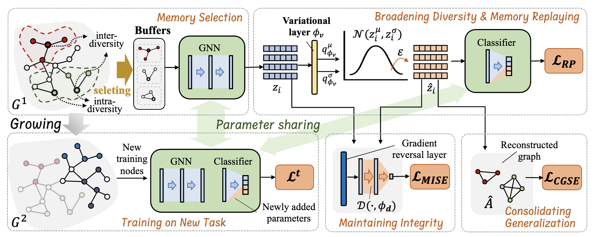

<<<<<<< HEAD
# DMSG
=======
# DMSG

This is the code associated with the ICLR 2025 paper “[Towards Continuous Reuse of Graph Models via Holistic Memory](https://openreview.net/forum?id=Pbz4i7B0B4)“ by Ziyue Qiao, et al. The code is based on the DGL library and is implemented in PyTorch.




## Running the Example:

The data is downloaded using the dgl library, as found in the "data_prepare(args)" function within "pipeline.py".

```bash
python train.py --dataset CoraFull-CL
```

## Citation

If this code assists in your research, please consider citing our paper:

```
@inproceedings{dmsg,
  title={Towards Continuous Reuse of Graph Models via Holistic Memory},
  author={Ziyue Qiao, Junren Xiao, Qingqiang Sun, Meng Xiao, Xiao Luo, Hui Xiong},
  booktitle={International Conference on Learning Representations},
  year={2025}
}
```
>>>>>>> 077750c (initial)
